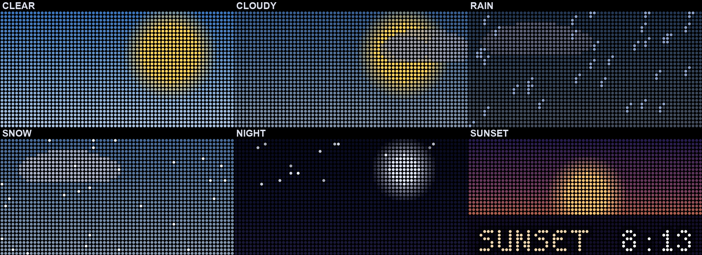

# TransitHub

[](https://github.com/kyranstar/transithub/actions/workflows/ci.yml)


**Live NYC subway arrivals *and* weather on a Raspberry Pi LED matrix, styled like a real MTA sign.**

<p align="center">
  
</p>

TransitHub drives an Adafruit-bonnet 64×32 RGB LED panel as a real-time subway sign, then
rotates in animated weather — all from free, **keyless** APIs (Open-Meteo + the MTA feeds).

## Highlights

### 🌦 Weather & notifications
Every 15 minutes the trains give way to an animated rundown: a scene matched to the current
**conditions *and* time of day** (sun, clouds, rain, snow, and a night sky whose moon tracks
the real lunar phase), the temp and today's
high/low, and flags that appear **only when they matter** — high UV, unhealthy AQI, and a
precise precip window like **`RAIN til 2a`** with chance and amount. Plus animated
sunrise/sunset notices and a `TRASH TMRW` reminder.

<p align="center">
  
  
</p>
<p align="center">
  
</p>

### ⚙️ Fully configurable
Track **any line, stop, and direction** in a few lines of YAML, **weight** how much screen
time each stop gets, pick °F/°C, and set polling intervals, the trash day, and notification
windows. `scripts/find_station.py "<name>"` prints stop IDs and what each direction means.

### 🧩 Runs anywhere — and builds without hardware
Works on **Pi 3 / 4 / Zero 2 W**, installs and starts **headless on boot** (systemd), and
ships a PNG **simulator** that renders the exact frames on any computer — so you can develop
and preview with no Pi or panel attached.

*Also:* real MTA GTFS-realtime arrivals (no key); **direction-aware** delay / reduced /
suspended badges that won't flag the wrong direction; clean countdowns that never show `0m`
and flash `Now` on arrival; correct NYC time even on a UTC Pi.

## Parts

| Part | Adafruit | Price |
|------|----------|-------|
| Raspberry Pi 3 Model B | [#3055](https://www.adafruit.com/product/3055) | $35.00 |
| 5V 2.5A micro-USB supply — powers the Pi | [#1995](https://www.adafruit.com/product/1995) | $8.25 |
| RGB Matrix Bonnet | [#3211](https://www.adafruit.com/product/3211) | $14.95 |
| 64×32 RGB LED matrix, 6mm pitch | [#2276](https://www.adafruit.com/product/2276) | $64.95 |
| 5V 4A power supply, UL-listed — drives the panel | [#1466](https://www.adafruit.com/product/1466) | $14.95 |
| **Total** | | **≈ $138** |

*Adafruit list prices (USD), before tax/shipping* — these are the convenient, known-good
versions, but you can spend far less by shopping around (a generic HUB75 panel, an old Pi you
already own, and any decent 5V supply). The only things you genuinely **need** are the **LED
matrix** and a **Raspberry Pi** — the bonnet is just tidy wiring (you can jumper the panel to
the Pi's GPIO by hand), and the second supply only matters once you push the panel bright.

You need **both** power supplies — the
panel pulls its 5V 4A from the bonnet's screw terminals while the Pi runs off its own
micro-USB supply. Any **Pi 3 / 4 / Pi Zero 2 W** works (Pi 5 isn't supported by the matrix
driver). Seat the bonnet on the Pi's GPIO header, plug the panel's ribbon + power into the
bonnet, and feed in the 5V 4A supply — see Adafruit's
[assembly guide](https://learn.adafruit.com/adafruit-rgb-matrix-bonnet-for-raspberry-pi). The
optional hardware-PWM jumper (see [Flicker tuning](#flicker-tuning)) is just a short wire.

## Install

On [Raspberry Pi OS Lite](https://www.raspberrypi.com/software/) **Bookworm or newer** (the
matrix binding needs Python 3.11+; enable SSH in the imager for headless):

```bash
git clone https://github.com/kyranstar/transithub.git
cd transithub && ./install.sh        # apt deps, builds the matrix binding, venv, config.yaml
sudo .venv/bin/transithub --config config.yaml   # sudo needed for GPIO timing
```

To start on every boot:

```bash
sudo cp systemd/transithub.service /etc/systemd/system/   # edit paths if not /home/pi/transithub
sudo systemctl enable --now transithub
journalctl -u transithub -f                               # logs
```

## Configure

Edit `config.yaml` (seeded from [`config.example.yaml`](config.example.yaml), which documents
every option). Stops look like:

```yaml
trains:
  - { line: "L", stop_id: "L16", direction: "N", weight: 3 }   # DeKalb Av → Manhattan
  - { line: "M", stop_id: "M08", direction: "N", weight: 1 }   # Myrtle-Wyckoff → Manhattan
```

The sign rotates between stops (each shows its next two trains); `weight` sets relative screen
time. Find IDs/directions with:

```bash
python scripts/find_station.py "dekalb"
# L16   DeKalb Av [L]  (Bk)    N -> Manhattan    S -> Canarsie - Rockaway Parkway
```

`config.example.yaml` also covers `location`/`weather`/`notifications`/`trash` and the
`matrix`/`display`/`alerts` tuning knobs.

## Develop & preview (no hardware)

```bash
pip install -e ".[dev]"
python -m pytest                                          # all logic is hardware-independent
transithub --config config.example.yaml --simulate --once # renders one frame to preview.png
```

The code is a data layer (`mta/`, `weather/`), a rendering layer (`display/` — scenes, a
drawing kit, and pluggable backends), and a small `Director` that schedules scenes.

## Flicker tuning

**Run the helper first (all models)** — it disables on-board sound (the #1 cause) and isolates
a CPU core, then prompts to reboot:

```bash
./scripts/reduce-flicker.sh
```

Usually enough on a Pi 4. On slower boards, tune `config.yaml`'s `matrix:` block:

| Board | `gpio_slowdown` |
|-------|-----------------|
| Pi Zero / Pi 1 | `0`–`1` |
| Pi 2 / Pi 3 / Pi Zero 2 W | `1`–`2` |
| Pi 4 | `3`–`4` |

Also lower `pwm_bits` to `8`/`7` (higher refresh) and optionally `limit_refresh_rate_hz: 100`
(a steadier rate). Sweep live with the static test, then copy the winners into your config:

```bash
sudo .venv/bin/python scripts/panel-test.py --slowdown 1 --pwm-bits 8 --limit-refresh 100
```

**Definitive fix on a Pi 3 / Zero 2 W:** solder a jumper between **GPIO4 and GPIO18** on the
bonnet (see [Improving flicker](https://github.com/hzeller/rpi-rgb-led-matrix#improving-flicker)),
then set `hardware_mapping: adafruit-hat-pwm`.

## Troubleshooting

- **Nothing on the panel** — check `journalctl -u transithub -f`; confirm `sudo` and that
  `hardware_mapping` matches your bonnet.
- **A row says "No service"** — that line has no upcoming trains right now (e.g. a weekend
  service change); verify the stop/direction with `find_station.py`.
- **"No module named …" only under sudo/systemd** — run via the venv binary
  (`.venv/bin/transithub`); the app keeps root (`matrix.drop_privileges: false`) so it can read
  the venv/fonts under `$HOME`.

## Credits

[hzeller/rpi-rgb-led-matrix](https://github.com/hzeller/rpi-rgb-led-matrix) (driver) ·
[Andrew-Dickinson/nyct-gtfs](https://github.com/Andrew-Dickinson/nyct-gtfs) (MTA parsing) ·
[Open-Meteo](https://open-meteo.com) (weather) ·
[spleen](https://github.com/fcambus/spleen) (font, BSD-2) ·
[MTA open data](https://www.mta.info/developers)

## License

MIT — see [LICENSE](LICENSE).
